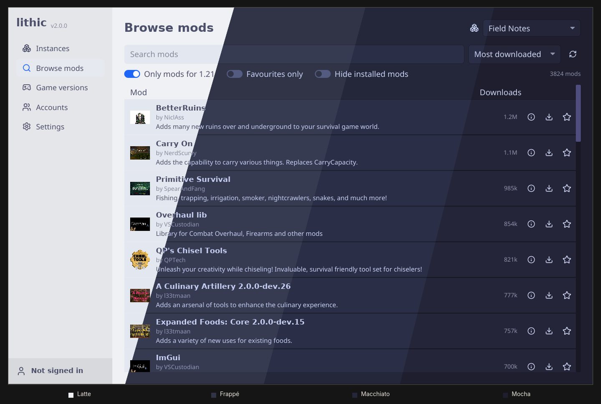
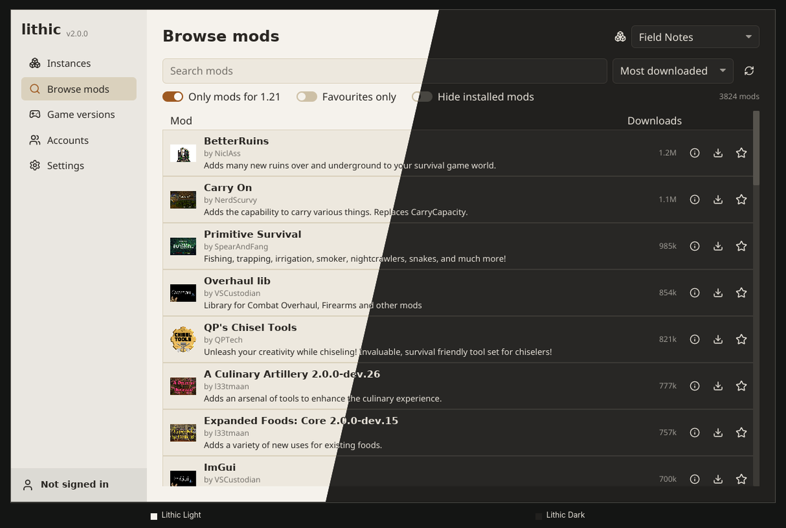
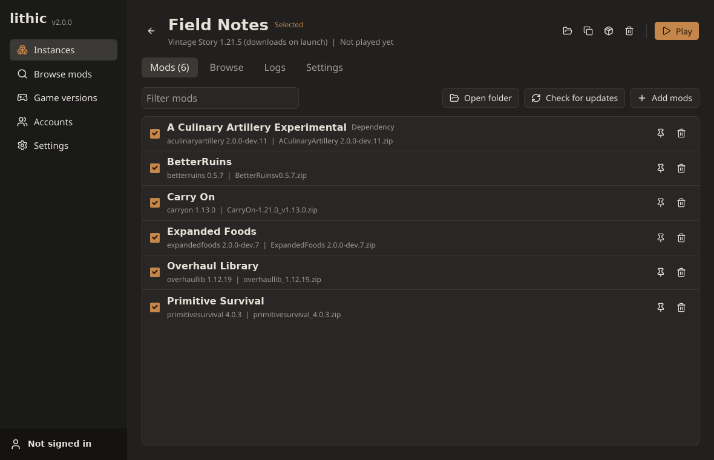
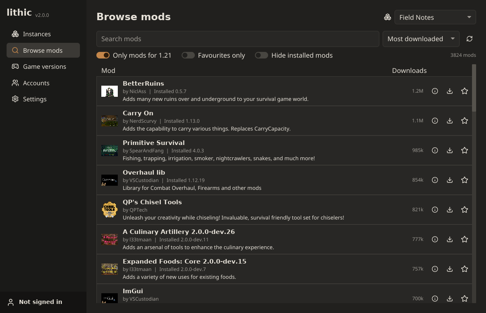
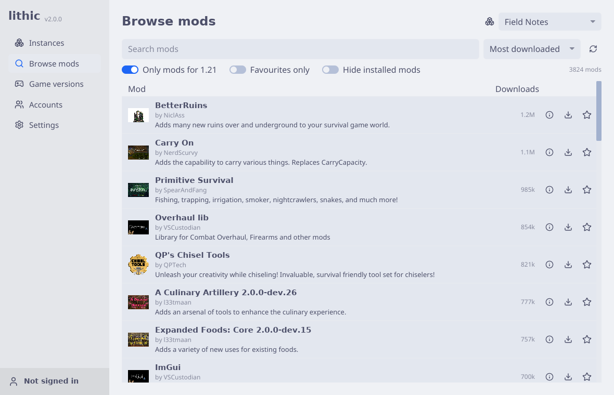
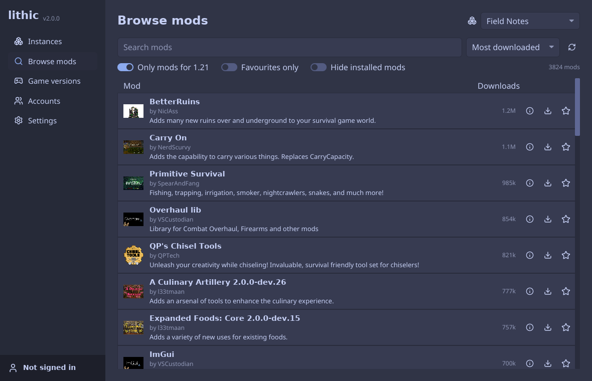
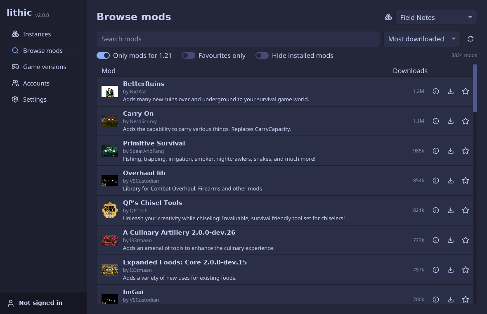
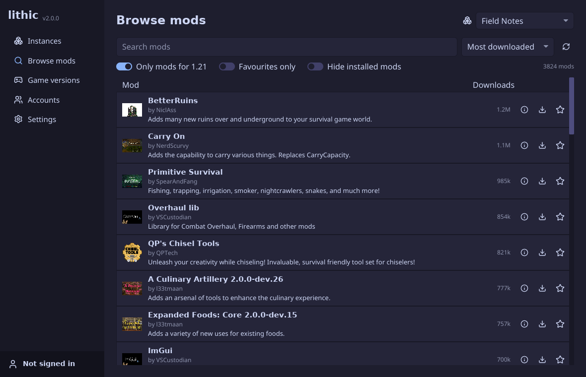

# Lithic

A fast, cross-platform mod manager for Vintage Story with both CLI and GUI
workflows. Browse, install, update, enable, disable, and organize your mods
without juggling folders by hand, whether you prefer scripting everything from
the terminal or managing your setup through a simple desktop interface.

It comes as a desktop app and a command line tool that share the same data, so
you can use whichever suits the moment.

<!--markdownlint-disable MD033-->

  

<!--markdownlint-enable MD033-->

## Features

- Downloads official game builds for Linux, macOS (Intel _and_ Apple Silicon)
  and Windows, checks them against the published checksums, and unpacks them.
  You can also point it at a game you installed yourself.
- Installs mods from the [ModDB](https://mods.vintagestory.at), picking the
  newest release made for your instance's game version, and pulls in the
  dependencies they declare. Updates, removals, pins and turning mods off are
  handled per instance.
- Warns about missing, outdated, disabled or duplicate dependencies before you
  find out from a crash.
- Signs in to your Vintage Story account, including two-factor codes, so the
  game starts logged in.
- Starts the game with the right data folder, keeps its output, records play
  time, and shows you the tail of the log when it crashes.
- Exports an instance as a pack file others can import, and opens the install
  buttons on the ModDB website.

Based a _little_ on prior art on Minecraft launchers, each instance is its own
setup with a game version, a data folder (worlds, settings, mod configs) and a
set of mods. You can keep a vanilla world, a heavily modded server profile and a
creative sandbox side by side without moving folders around.

## Installation

Install Lithic with Nix, a prebuilt release archive, or from source. The
[installation guide](INSTALLATION.md) covers NixOS, non-NixOS systems, and
step-by-step Windows instructions.

## Usage

Lithic provides both a GUI and a CLI for managing Vintage Story mods, instances,
game versions, and modpacks. See the [usage guide](USAGE.md) for first-time
setup and common workflows. You can also find instructions about migrating from
Lithic v1.x here.

## Demo

<!--markdownlint-disable MD033-->

More screenshots

  <strong>Lithic Light and Dark</strong> 
  

  <strong>Instance</strong> 
  

  <strong>Browse mods</strong> 
  

  <strong>Catppuccin Latte</strong> 
  

  <strong>Catppuccin Frappé</strong> 
  

  <strong>Catppuccin Macchiato</strong> 
  

  <strong>Catppuccin Mocha</strong> 
  

  <strong>All four Catppuccin variants</strong> 
  

<!--markdownlint-enable MD033-->

## License

[@Tekunogosu/rustique]: https://github.com/Tekunogosu/rustique

This project is derived from [@Tekunogosu/rustique], originally licensed under
the MIT License. Original copyright and MIT license text are preserved in
[`LICENSES/MIT.txt`](../LICENSES/MIT.txt). Modifications and new project code
are distributed under the Mozilla Public License (MPL) version 2.0. See
[LICENSE](../LICENSE) for more details on the exact conditions. An online copy
is [provided here](https://www.mozilla.org/en-US/MPL/2.0/).

The icons all across the UI are from Lucide, which is licensed under ISC. The
upstream license is provided in
[`crates/lithic-icons/assets/icons/LICENSE`](../crates/lithic-icons/assets/icons/LICENSE).
